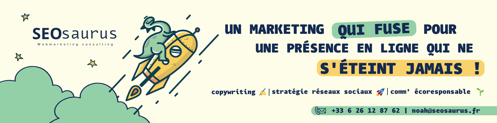

# Welcome to My GitHub Profile

**Hello, I'm Noah Sturtzer, a passionate web marketing enthusiast, always eager to learn new skills and open to exciting opportunities as a freelancer or in a full-time role.** I'm also the proud owner of *SEOsaurus webmarketing consulting*.

## About Me

🚀 I'm a dedicated follower of the world of web marketing, **constantly searching for innovative ways to enhance online visibility, generate qualified traffic, and maximize conversions**.

📚 I firmly believe in continuous learning. Every day presents an opportunity for me to explore new strategies, master tools, and stay on the cutting edge of the latest digital marketing trends. Because I believe that **practise makes perfect**, I'm improving my skills trying to learn at least one new thing everyday.

💼 Currently, **I'm open to opportunities as a freelancer**, where I can put my web marketing skills to work in helping clients achieve their online goals. **I'm also interested in full-time positions** at exciting companies that share my vision of digital marketing.

## Skills

- 📊 Data analysis and interpretation to optimize marketing campaigns.
- 🖋️ High-quality content writing for websites, blogs, and social media.
- 📈 Management of paid advertising campaigns, such as Google Ads and Meta Ads.
- 📧 Creation and automation of email marketing campaigns.
- 📱 Websites content creation optimized for search engines (SEO).
- 📣 Building and managing a social media presence to enhance brand awareness.

## Contact

If you have any questions, collaboration opportunities, or just want to discuss web marketing, **feel free to reach out**. You can contact me through:

- 📧 [noah@seosaurus.fr]
- 🔗 [LinkedIn](https://www.linkedin.com/in/noahsturtzer)

I'm looking forward to connecting with you and exploring new exciting opportunities in the world of web marketing. Let's team up to achieve new online heights!

  

Thank you for visiting my GitHub profile.

<h3 align="left">Connect with me:</h3>

<h3 align="left">Languages and Tools:</h3>

     

